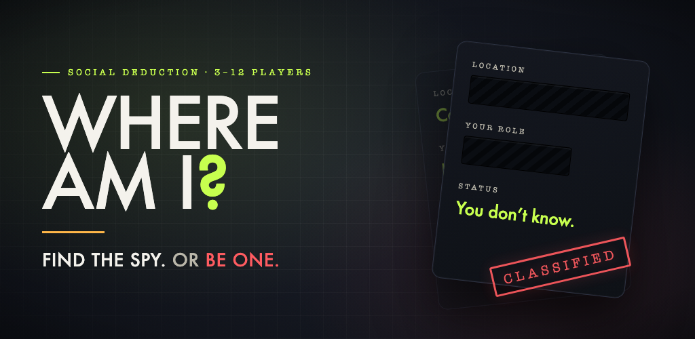
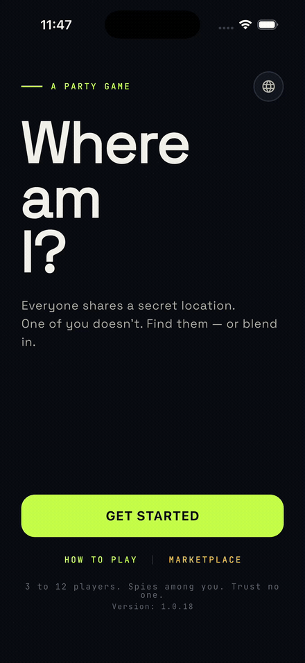
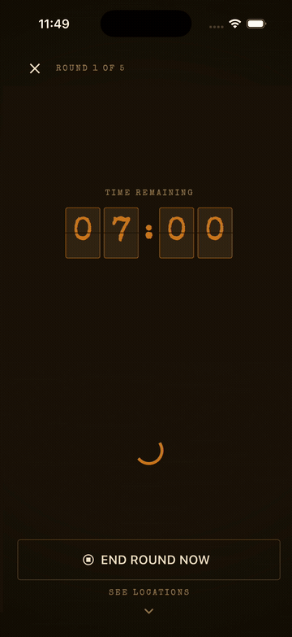
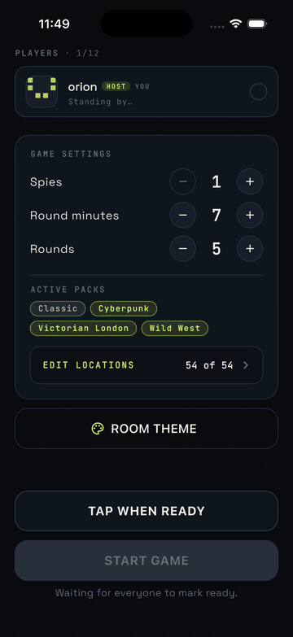
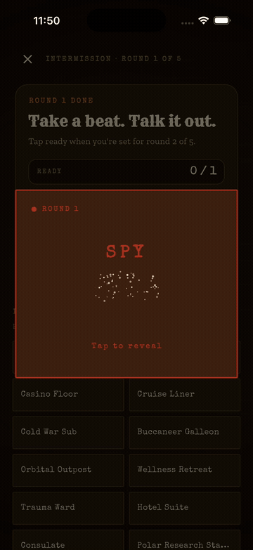
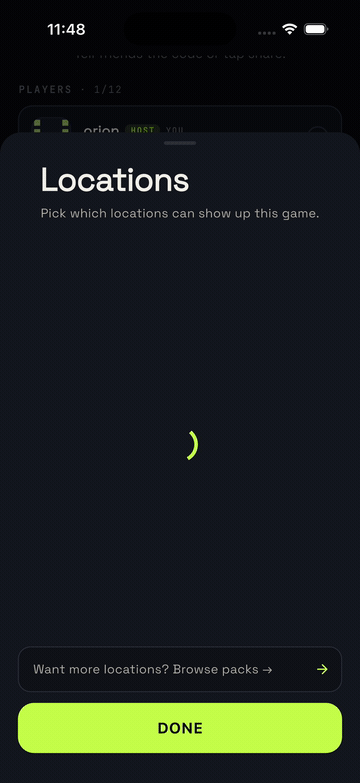
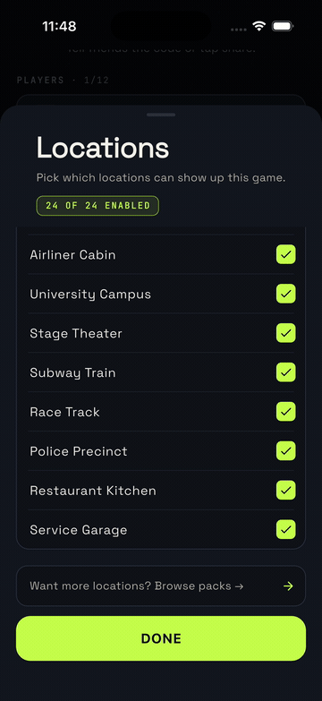

<div align="center">



<br>

**A real-time party game of bluffing and deduction, for the people already sitting next to you.**

No accounts. No ads. No app deciding who won.

[](https://apps.apple.com/us/app/where-am-i-spy-game/id6764593980)
[](https://whereami-ea329.web.app)

&nbsp;


<br>



</div>

---

## How it plays

Somebody creates a room and reads out four letters. Everyone joins from their own phone — or you pass one phone around the table, that works too.

Each round you secretly see **where you are** and **who you are** there: *Trauma Ward, Night Shift Surgeon.* Everyone sees the same location. Everyone except one player, who gets a card that just says **you don't know**.

Then you talk. Ask each other questions and answer them out loud. Too vague and you look like the spy. Too specific and you've handed the spy the location. The whole game is that one dial, and everybody's turning it at once.

<div align="center">
<table>
<tr>
<td align="center" width="33%"><br><sub><b>Press and hold</b><br>Your location and your role.<br>Or, if you drew the short straw,<br>neither of them.</sub></td>
<td align="center" width="33%"><br><sub><b>Reskin the whole room</b><br>Classic, Cyberpunk, Victorian<br>London, Wild West — the host<br>picks, everyone sees it.</sub></td>
<td align="center" width="33%"><br><sub><b>Then the reckoning</b><br>Round's up. Argue it out,<br>then find out whether you<br>were right.</sub></td>
</tr>
</table>
</div>

Two things keep it from being a straight guessing game.

**The spy can call it.** Any time before the timer runs out, the spy can come clean — *"I'm the spy"* — and take a single shot at naming the location. Right, and they steal the whole round. Wrong, and everyone else wins on the spot.

**A wrong accusation is expensive.** You can vote someone out whenever you're sure, not just at the end. Catch the spy and the crew takes it. Point at the wrong person and the real spy gets *two* guesses at the location to turn the game around.

The app never votes for you and never announces a winner. It deals the cards, runs the clock, and gets out of the way.

## Why it's good

**Nobody has to babysit the timer.** The countdown lives on the server, not on your phone. Lock the screen, take a call, walk out of Wi-Fi range and come back — everyone's clock still reads the same number.

**Put the phone down and play.** On iOS the round runs as a Live Activity, on Android as a live countdown in your notification shade. The timer stays visible while you're mid-argument with the screen off.

**Nothing between you and a game.** No account, no email, no invite link to chase down. Four letters and you're in — and if someone doesn't want to install anything, [the browser version](https://whereami-ea329.web.app) puts them at the same table.

**Tunable.** 1–3 spies, 1–15 minute rounds, 1–10 rounds per game.

**Actually private.** No ads, no analytics SDKs, no tracking. No location, contacts, camera, or microphone access. The only thing stored on your device is a random ID so you can get back into a game you dropped out of.

**English and Turkish**, down to every last role name.

## Packs

24 locations are free forever, each with 11 unique roles — enough that a full 12-player room never repeats a part. If you want more, there are 15 one-time purchases: 12 cities and 3 full themes.

> **Cities** — Istanbul · Paris · Tokyo · Stockholm · New York · London · Rome · Cairo · Rio · Berlin · Dubai · Bangkok
>
> **Themes** — Cyberpunk · Wild West · Victorian London

<div align="center">
<table>
<tr>
<td align="center" width="50%"><br><sub><b>The host picks the deck</b><br>Toggle any location out before you start.<br>Locked in the moment the game begins,<br>so nobody reshuffles the pool mid-round.</sub></td>
<td align="center" width="50%"><br><sub><b>Buy it once, keep it</b><br>No subscription, no premium currency,<br>no timed unlocks. The host's packs<br>cover everyone in the room.</sub></td>
</tr>
</table>
</div>

A theme isn't just extra cards. Buy Wild West and the entire app becomes a saloon — kraft paper, wanted-poster role cards, a flip-clock counting you down. Victorian London gets fog, calling cards, and a pocket watch.

## Questions people actually ask

<details>
<summary><b>Can't someone cheat by digging through their phone's network traffic?</b></summary>
<br>

No. Your location and your role are never part of what the room broadcasts — the shared game state genuinely doesn't contain them. Each player fetches their own card individually, so there's no packet anywhere on your device that holds someone else's secret. Snooping the wire gets you a player list and a timer.

</details>

<details>
<summary><b>Do we all need the app installed?</b></summary>
<br>

No. One phone passed around the table is a completely normal way to play, and anyone who'd rather not install anything can join from <a href="https://whereami-ea329.web.app">the browser</a> instead. If everyone does have the app, they join with the four-letter code and each get their own private card — which is nicer, because nobody has to look away.

</details>

<details>
<summary><b>My phone died in the middle of a round. Am I out?</b></summary>
<br>

Reopen the app and you're back in the same room. Your seat is held by an ID stored on your device, so you don't need to be re-invited, and because the countdown is server-side you come back to the same number everyone else is looking at.

</details>

<details>
<summary><b>What happens if the host leaves?</b></summary>
<br>

The room hands itself to whoever joined earliest and carries on. It only disappears when the last person walks out.

</details>

<details>
<summary><b>Does the app decide who won?</b></summary>
<br>

Never. There's no in-app vote, no scoreboard, no verdict screen. The vote happens at the table, out loud, the way an argument should. The app tells you who the spy was and lets you sort out the rest.

</details>

<details>
<summary><b>Is it free?</b></summary>
<br>

The game is free, and so are 24 locations with all their roles — that's a full game night without spending anything. Packs are optional one-time purchases if you want new material.

</details>

## Under the hood

Flutter and Riverpod on the front, [Convex](https://convex.dev) on the back. Room state streams over websockets, so somebody joining shows up on twelve phones at once with no polling and no refresh button.

The parts that were actually interesting to build:

- **Server-authoritative rounds.** Clients derive the countdown from a server timestamp rather than ticking down locally, which is why backgrounding the app can't desync anyone.
- **Silent push to keep the widget alive.** iOS Live Activities and Android's ongoing notification get moved by silent APNs/FCM — the only way to advance a chronometer while the app is fully suspended.
- **Skins as a theme extension.** A theme pack swaps one `AppSkin` `ThemeExtension` — colors, fonts, textures, timer widget, role-card frame — and syncs the choice to every device in the room.

```bash
flutter pub get
flutter run                 # ships pointed at the hosted backend
flutter test
```

Running your own backend:

```bash
npm install
npx convex dev              # from the repo root, not from inside convex/
npx convex run locations:seed
```

## Say hi

Got an idea for a pack, a feature, or a bug that ruined a round — [open an issue](https://github.com/orion-supernova/spygame/issues) or email **info@walhallaa.com**. Every message gets read.

<div align="center">
<br>
<sub>Built by <a href="https://walhallaa.com">Murat Can Koç</a> · <a href="https://walhallaa.com/whereami-privacy-terms">Privacy &amp; Terms</a></sub>
</div>
